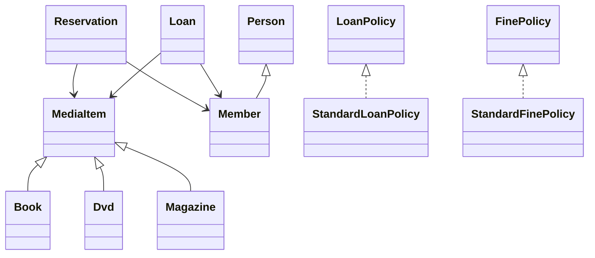

# Library Management System

A Java console application demonstrating clean OOP architecture for managing media items, members, loans, fines, and reservations.

## Overview

The Library Management System (LMS) is designed for an Advanced OOP module and emphasizes maintainable design, clear separation of concerns, and extensibility.

Key capabilities include:
- Media item management (Books, DVDs, Magazines)
- Member registration and validation
- Loan processing (checkout/return) and fine calculation
- Reservation queueing with lifecycle states
- Strategy-based policies for loan durations and fines
- Custom exception handling for domain validation

## Features

- Media management with availability tracking (`AVAILABLE`, `ON_LOAN`, `RESERVED`)
- Member status and borrowing restrictions
- Loan history tracking with automatic due date and fine calculation
- FIFO reservation queue with auto-fulfillment
- Console-driven workflow for common tasks

## Architecture

The project follows a layered, OOP-focused structure:
- `domain/`: core entities, policies, and domain services
- `app/`: application entry point
- `presentation/`: console UI and interaction layer
- `infrastructure/`: storage or integration concerns (as needed)
- `common/`: shared utilities and exceptions

### Class Relationships (High-Level)



## Project Structure

```
src/
  app/             # App entry point (main)
  common/          # shared utilities/exceptions
  domain/          # core model, policies, services
  infrastructure/  # persistence/integration (if added)
  presentation/    # console UI
  resources/
test/              # simple main-based tests
```

## Getting Started

### Prerequisites

- Java 11+ (Java 8 may work, but 11+ is recommended)

### Build and Run

```bash
mkdir -p out
javac -d out $(rg --files -g "*.java" src)
java -cp out app.App
```

### Run the Tests

Tests are simple `main`-based classes.

```bash
mkdir -p out
javac -d out $(rg --files -g "*.java" src test)
java -cp out LoanTest
java -cp out StandardFinePolicyTest
```

## Usage

When you start the app, follow the console menu to:
- List items and members
- Check out and return media
- Add new media
- Reserve items

### Example Session (Abbreviated)

```text
1) List items
2) List members
3) Checkout item
4) Return item
5) Reserve item
6) Add new media
Select option: 3
```

## Design Patterns & OOP Concepts

- Strategy pattern for `LoanPolicy` and `FinePolicy`
- Custom `ValidationException` for domain rule violations
- Inheritance for media types and people
- Encapsulation with controlled accessors

## Future Improvements

- JSON or file-based persistence
- GUI (JavaFX or Swing)
- Authentication for librarians
- Enhanced searching/reporting

## License

MIT License

## Author

Leo Baldwin
